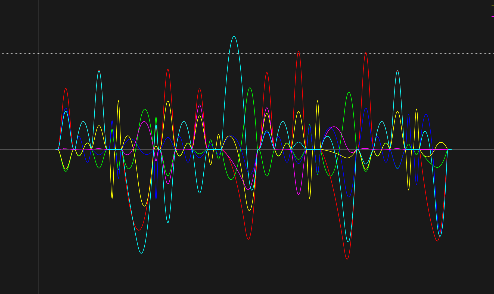
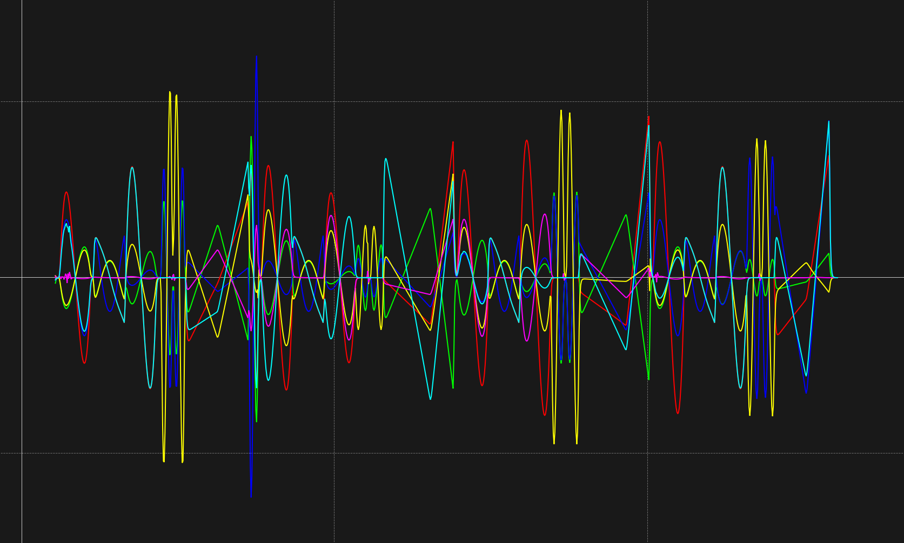
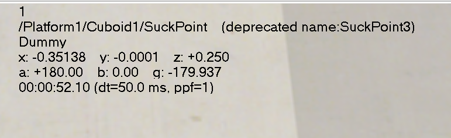
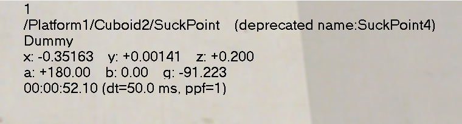
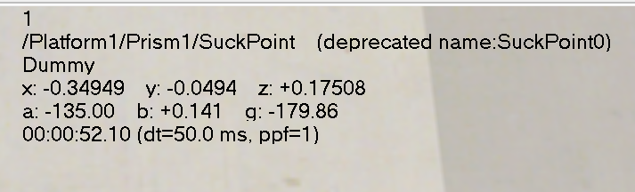
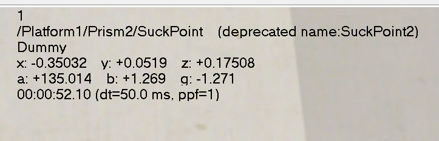

## <center>  轨迹规划实验报告 </center>
### 实验目的和要求
#### 实验目的：
- 了解轨迹规划的基本方法
- 学习在仿真中对机械臂进行轨迹规划
#### 实验要求：
- 通过控制机械臂关节运动，将搬运起点处的四个物块，通过染色池（直线运动），最终搬运至终点处，并摆放成特定形状
- 保证机械臂和物块在运动过程中不与其他物体碰撞
- 机械臂各关节的运动速度和加速度应符合限制
- 机械臂各关节的速度和加速度应尽可能保证平滑
### 实验内容与原理
每个物块在笛卡尔坐标系的运动为从起点到染色池的入口，然后在染色池中做直线运动，最后从染色池的出口到终点，（为了避免物块和平台以及物块间的物理碰撞，我们在终点前还设置了一个中间点，同时，机械臂从终点返回起点时，为了避免关节角的大幅变化，也设置了一个中间点）各物块的初始位姿已给出，终点位姿需要我们计算得到，如下所示：
```python
  Cubiod2 : -0.35,0,0.2,-np.pi,0,-np.pi/2
  Prism2 : -0.35,0.05,0.175, 3*np.pi/4, 0,0
  Prism1 : -0.35, -0.05,0.175, np.pi/4, np.pi,0
  Cubiod1 : -0.35,0,0.25,-np.pi,0,-np.pi
```
规划出机械臂在笛卡尔空间中需要达到的目标位置后，我们用逆运动学求解器将笛卡尔空间的目标位置转换为关节空间中的目标位置，最后通过关节空间的轨迹规划，控制机械臂的关节运动，实现机械臂的运动控制。

在机械臂的关节空间轨迹规划中，我们采用了三种轨迹规划方法，分别是：五次多项式规划，带中间点的三次多项式规划，以及直线规划，下面分别论述每种方法的原理与目的

**五次多项式规划：** 五次多项式共有六个参数，分别是$a_0, a_1, a_2, a_3, a_4, a_5$，通过给定的初始位置、初始速度、初始加速度、目标位置、目标速度、目标加速度，可以求解出这六个参数，从而得到一个五次多项式函数，该函数可以保证关节位置、速度、加速度的平滑性
  $$
    \begin{aligned}
        &\theta(t) = a_0 + a_1t + a_2t^2 + a_3t^3 + a_4t^4 + a_5t^5 \\
        &\dot{\theta}(t) = a_1 + 2a_2t + 3a_3t^2 + 4a_4t^3 + 5a_5t^4 \\
        &\ddot{\theta}(t) = 2a_2 + 6a_3t + 12a_4t^2 + 20a_5t^3
    \end{aligned}
  $$
约束条件：
    $$
        \begin{aligned}
            &\theta(0) = \theta_0, \dot{\theta}(0) = \dot{\theta}_0, \ddot{\theta}(0) = \ddot{\theta}_0 \\
            &\theta(T) = \theta_T, \dot{\theta}(T) = \dot{\theta}_T, \ddot{\theta}(T) = \ddot{\theta}_T
        \end{aligned}
    $$
在机械臂的轨迹规划中，从起点到染色池的入口和从染色池的出口到终点，均采用了五次多项式规划

**直线规划：** 由于在染色池中需要物块在笛卡尔坐标系中做直线运动，因此我们采用了直线规划的方法，其原理是通过给定的初始位置、目标位置、以及规定的时间，可以通过插值的方法，得到不同时刻物块在笛卡尔坐标系中的位置，然后再利用逆运动学求解器得到每个时刻机械臂的关节位置。
$$
    \begin{aligned}
        \mathbf{p}(t) &= \mathbf{p}_0 + \frac{\mathbf{p}_T - \mathbf{p}_0}{T}t \\
        \theta(t) &= \text{IK}(\mathbf{p}(t))
    \end{aligned}  
$$

**带中间点的三次多项式规划：**  当机械臂放置完一个物块返回起点时，需要给定一个中间点，否则机械臂关节角会产生大幅度变化，在实际情况中会消耗许多能量。但是我们又希望机械臂在中间点不发生停顿（即速度不为0），因此采用了带中间点的三次多项式规划（不采用五次多项式规划的原因是五次多项式需要显式地给出中间点的速度和加速度，但我们并不知道在关节空间中的速度为多少）。
带中间点的三次多项式规划是通过给定的初始位置、目标位置、中间点位置，初始速度和加速度、目标速度和加速度以及每段规定的时间，还有两个约束条件是中间点的速度和加速度连续，可以求解出两个三次多项式的参数，从而得到两个个三次多项式函数，该函数可以保证关节位置、速度、加速度的平滑性
$$
    \begin{aligned}
        &\theta_1(t) = a_0 + a_1t + a_2t^2 + a_3t^3 \\
        &\dot{\theta_1}(t) = a_1 + 2a_2t + 3a_3t^2 \\
        &\ddot{\theta_1}(t) = 2a_2 + 6a_3t \\
        &\theta_2(t) = a_4 + a_5t + a_6t^2 + a_7t^3 \\
        &\dot{\theta_2}(t) = a_5 + 2a_6t + 3a_7t^2 \\
        &\ddot{\theta_2}(t) = 2a_6 + 6a_7t
    \end{aligned}
$$
约束条件：
    $$
        \begin{aligned}
            &\theta_1(0) = \theta_0, \dot{\theta_1}(0) = \dot{\theta}_0 \\
            &\theta_1(T_1) = \theta_T, \theta_2(0) = \theta_T \\
            &\theta(T_2) = \theta_{end}, \dot{\theta}(T_2) = \dot{\theta}_{end} \\
            &\dot{\theta_1}(T_1) = \dot{\theta}_2(0),\ddot{\theta_1}(T_1) = \ddot{\theta_2}(0) \\
        \end{aligned}
    $$

### 主要仪器设备
- 仿真环境：CoppeliaSim
- 仿真模型：ZJU-1机械臂
- 仿真语言：python


### 实验结果与分析
仿真运行的视频见附件

**平滑性分析：**
下图为机械臂运动时速度和加速度的变化曲线，可以看出速度和加速度均较为平滑，符合要求
   <div align = "center">
   <p align="center"><b> 速度曲线</b> </p >
   
   </div>
    <div align = "center">
   <p align="center"><b> 加速度曲线</b> </p >
   
   </div>
<br>

**准确性分析：**
下图为各物块最终的位置，可以看出各物块均摆放在了指定的位置，误差不超过1%，说明轨迹规划的准确性较高
<div style="display: flex; justify-content: space-around; align-items: center;">
  <div style="text-align: center;">
    
    <p><b>Cubiod1</b></p>
  </div>
  <div style="text-align: center;">
    
    <p><b>Cubiod2</b></p>
  </div>
</div>
<div style="display: flex; justify-content: space-around; align-items: center;">
  <div style="text-align: center;">
    
    <p><b>Prism1</b></p>
  </div>
  <div style="text-align: center;">
    
    <p><b>Prism2</b></p>
  </div>
</div>
